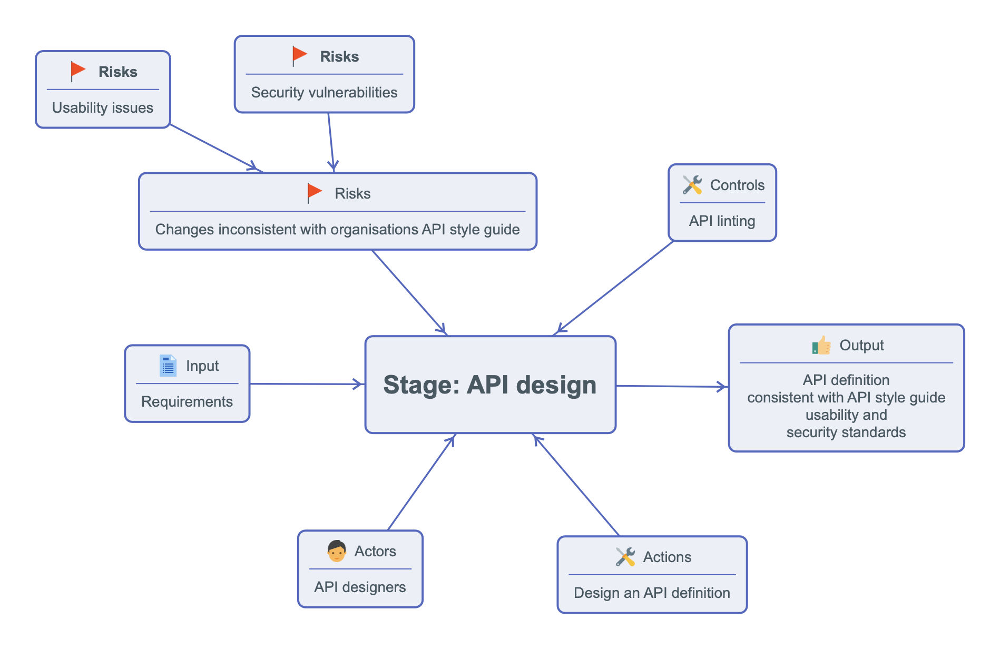

# API Consistency Controls - API Linting

## The problem
- When multiple teams in an org build APIs, standardization and inconsistency problems arise.  
  - 51% of the respondents to the 2023 Smartbear State of Software Quality | API report sited standardization as the biggest challenge in API development.
- There is no time to read, remember and apply all the details of your API style guides. 
  - 43% of the respondents of the Postman State of API 2023 report sited lack of time as the biggest obstacle to producing APIs.
- Teams face high cognitive load. Minutiae of API design is specialist knowledge.
  - The 3rd highest obstacle to producing APIs in the Postman survey is the lack of API design skills.

## Solution
- Use API linting tools to enforce API style guides and standards. 
- Ideally, the linting tool should be integrated into the CI/CD pipeline.
  

## Benefits
- Improved API consistency and developer experience for the API consumer.
- Improved lead time in API design. 
- Improved API security at the design stage. 
- Eliminate time and mental effort spent on debating standards.

## How to do it - the code
See the [Code and run output](./.github/workflows/api-delivery-patterns.yml)

## What to look out for when choosing an API linting tool
- Speed! 
- Good error messages
- Ease of writing rules
- Extra: managing API definition files (bundling, splitting, joing, etc.)

## Challenges
- No style guide on which to base the linting rules
- API definitions not in version control
- Writing rules takes effort and specialized knowledge
- No API platform / governance team to support the rules

## Contraindications
- Early part of product development
- Small number of teams
- Non important API

## Alternatives
- Manual API design reviews & checklists

## Tips 
- Do start linting even if you don't have a style guide
  - Even the most basic linting rules (e.g the OpenAPI file is valid) can save a lot of time.
  - Easy to add more rules later.
- Lint in the pipeline. 
- Provide docs & tools for linting locally and fast feedback.
- You may need more than one kind of linter 
  - (E.g for SDKs, documentation portal, gateway config, guide docs)
