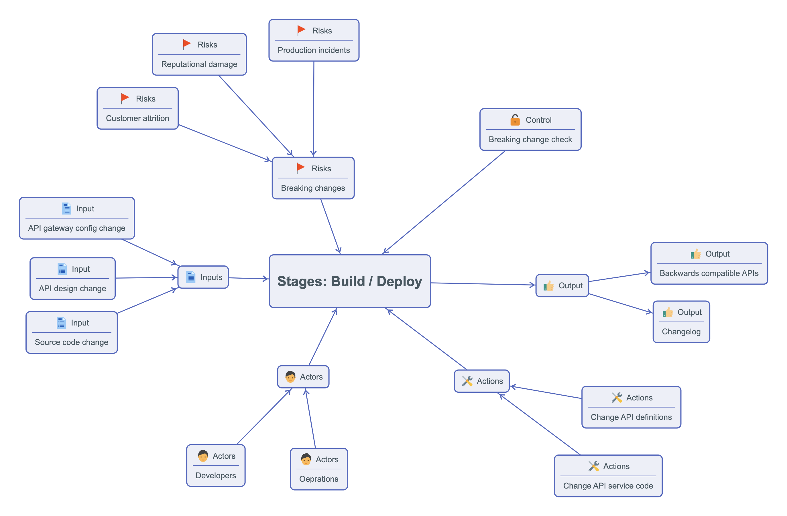

# Automated Breaking change Controls

## The problem

**Real customer quote 1:**  "You should stop doing breaking changes to the api ASAP. If you do not, as a business, you will lose a massive amount of customers and lose reputation. The reasoning is simple: The API provides a business-critical data infrastructure for a lot of applications.
There can be integrations/SDK that are done one one-time basis, without on-going support. ....the integration is supposed to work for years ahead, since APIs are not supposed to be changed. "

**Real customer quote 2:** "The way [company] handles API changes is going to impact our business since we consume the data in production. We are left without any solutions or guidelines. We found out a bit late about the breaking change that is going to happen tomorrow..."

## The solution
- Evolve the API without introducing breaking changes.
- Use breaking change tools to catch unintended breaking changes.
 

## Benefits
- Better API adoption and customer satisfaction.
- Reduced support costs related to breaking changes. 
- Lower cognitive load regarding breaking changes 

## How to do it - the code

## What to look out for when choosing a breaking change / diff tool
- Well-defined breaking change rules
- Should also generate OpenAPI change log 

## Challenges
- Absence of API providers breaking change policy
- Handling deprecations

## Contraindications
- Early part of product development

## Alternatives
- Manual API design reviews
- Consumer-driven contract testing with internal APIs