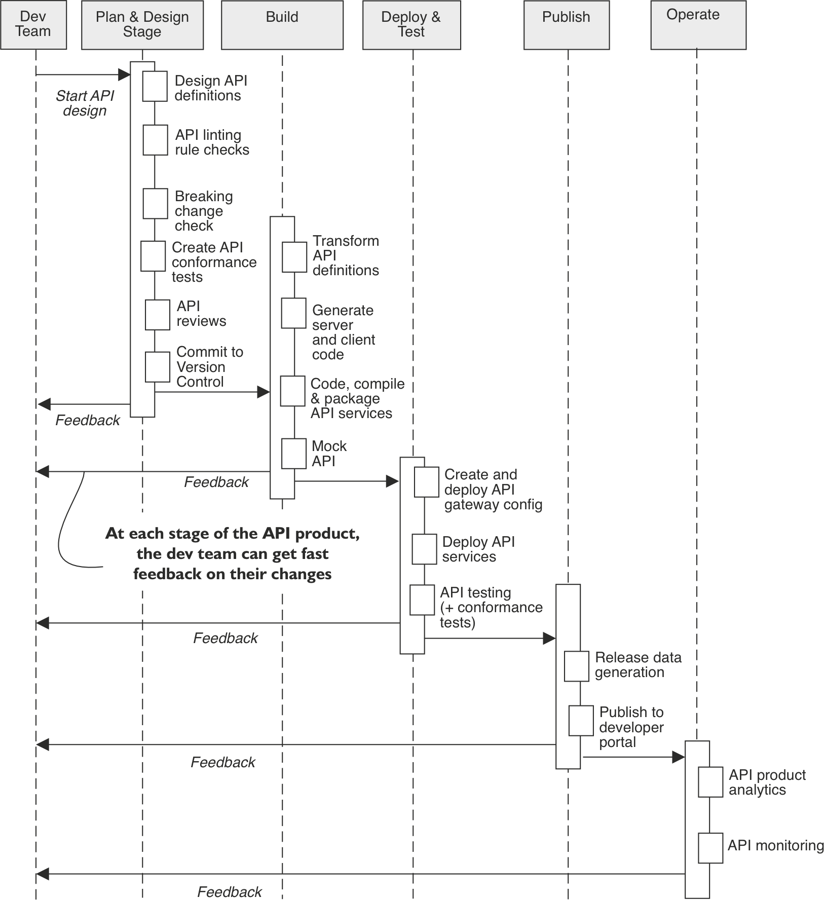

# Introduction 

## About me
- Principal Consultant at [Ikenna Consulting](https://ikenna.co.uk)
- We help organizations increase the value of their APIs and lower the cost of API delivery.
- Author [Automating API Delivery (Manning, 2023)](https://shortener.manning.com/Y1ja)
  - "Automating API Delivery is my go-to source to help solution architects and API development teams understand how to introduce API governance processes" - Mark Body
  - "When it comes to scaling the API practice for both speed and scale, this book goes deep into the details of how to manage APIs in an effective and scalable way" - Eric Wilde
  

## Goal of the talk: 
 - Show how to use 4 control patterns to reduce risk and improve the value of your API.

## Why this talk:
 - If you do not have these controls yet, adding them will help you improve
   - the developer experience of your API 
   - your operational efficiency

## Why patterns
 - At a high-level, API development processes face common problems that have common solutions.
 - Example API production workflow:

 
## The pattern language I'll use
 - For each pattern
   - Problem/Why?
   - High-level solution
   - Benefits
   - Code example
   - Challenges
   - Contraindications (when not to use it)
   - Tips + What to look out for when choosing a tool
   - Alternative patterns / practices
 