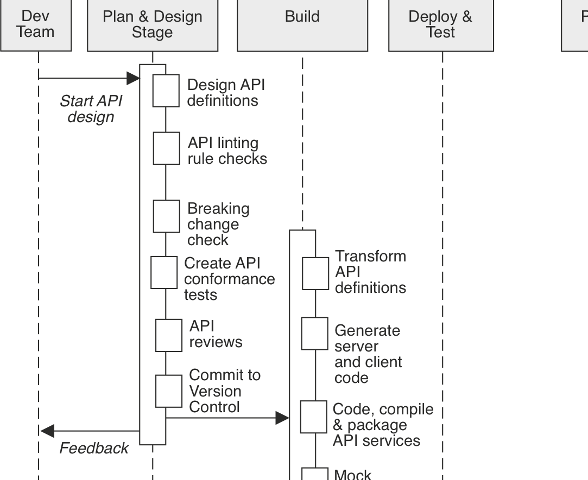

# Introduction 

## Goal of the talk: 
 - Show how to use 4 control patterns to reduce risk and improve the value of your API.

## Why this talk:
 - If you do not have these controls yet, adding them will help you improve
   - the developer experience of your API 
   - your operational efficiency

## Why patterns
 - At a high-level, API development processes face common problems that have common solutions.
 - Example API production workflow:

 
## The pattern language I'll use
 - For each pattern
   - Problem/Why?
   - High-level solution
   - Benefits
   - Code example
   - Challenges
   - Contraindications (when not to use it)
   - Tips + What to look out for when choosing a tool
   - Alternative patterns / practices
 